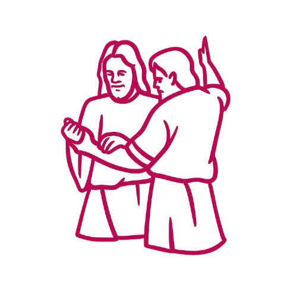

# Acompanhamento de Pessoas — App Mobile (React/Expo)



## 🎯 Objetivo
Este aplicativo mobile foi desenvolvido para relatar e acompanhar o progresso das pessoas atendidas pelos missionários da Igreja de Jesus Cristo dos Santos dos Últimos Dias.

Com o app, colaboradores e membros que trabalham junto aos missionários conseguem:

- Visualizar evolução pessoal
- Acompanhar metas e planos
- Conferir desempenho semanal
- Organizar visualizações por unidade da igreja (organização)
- Monitorar o trabalho dos missionários em tempo real

Este repositório representa a **versão mobile (React/Expo)**, focada na **inserção de dados e acompanhamento durante visitas e estudos**.

## 📱 Ecossistema
Além da interface web principal, há este aplicativo React/Expo onde:

- Usuários podem inserir todos os planos e metas das reuniões
- Dados são sincronizados com a aplicação web
- Facilita registros durante visitas e estudos

Repositório web:
```
https://github.com/Tyago-santos/project_lma
```

## ⚙️ Tecnologias Utilizadas
- React + Expo
- Styled-components / GlobalStyle
- Redux Toolkit (themeSlice etc.)
- React Router
- ESLint
- Firebase (presumido por `firebaseConfig.js`)

## 🚀 Como Usar
1. Clonar o repositório
```
git clone https://github.com/Tyago-santos/lma-mobile
cd lma-mobile
```

2. Instalar dependências
```
npm install
```

3. Executar em modo de desenvolvimento
```
npm run start
```

> O Expo abrirá o painel local com as opções de execução no dispositivo.

## 🧭 Observações
- Ajustes de ambiente e chaves podem estar em `firebaseConfig.js`.
- Estrutura organizada com componentes reutilizáveis, reducers de tema e rotas de telas.

